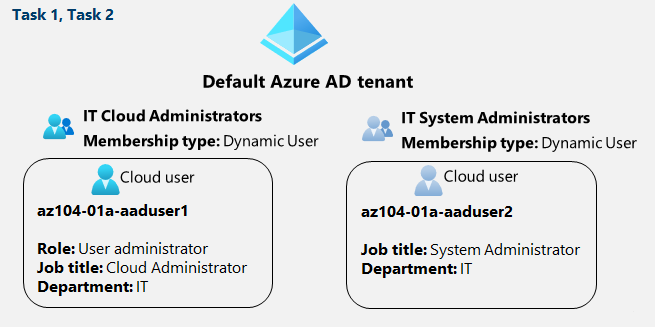

---
lab:
    title: '01 - Manage Microsoft Entra ID Identities'
    module: 'Administer Identity'
---

# Lab 01 - Manage Microsoft Entra ID Identities

# Student lab manual

## Lab scenario

In order to allow Contoso users to authenticate by using Microsoft Entra ID, you have been tasked with provisioning users and group accounts. Membership of the groups should be updated automatically based on the user job titles. You also need to create a test Microsoft Entra ID tenant with a test user account and grant that account limited permissions to resources in the Contoso Azure subscription.

**Note:** An **[interactive lab simulation](https://mslabs.cloudguides.com/guides/AZ-104%20Exam%20Guide%20-%20Microsoft%20Azure%20Administrator%20Exercise%201)** is available that allows you to click through this lab at your own pace. You may find slight differences between the interactive simulation and the hosted lab, but the core concepts and ideas being demonstrated are the same.

## Objectives

In the lab, you will:

+ Task 1: Create and configure users
+ Task 2: Create groups with assigned and dynamic membership

## Estimated timing: 30 minutes

## Architecture diagram

## Instructions

### Exercise 1

### Task 1: Create and configure Microsoft Entra ID users

In this task, you will create and configure Microsoft Entra ID users.

>**Note**: If you have previously used the Trial license for Microsoft Entra ID Premium on this Tenant you will need a new Microsoft Entra ID Tenant and perform the Task 2 after Task 3 in that new Microsoft Entra ID tenant.

1. Sign in to the [Azure portal](https://portal.azure.com).

1. In the Azure portal, search for and select **Microsoft Entra ID**.

1. On the Microsoft Entra ID blade, scroll down to the **Manage** section, click **User settings**, and review available configuration options.

1. On the Microsoft Entra ID blade, in the **Manage** section, click **Users**, and then click your user account to display its **Profile** settings. 

1. Click **edit properties**, in the **Settings** section, set **Usage location** to **United States** and click **save** to apply the change.

    >**Note**: This is necessary in order to assign an Microsoft Entra ID Premium P2 license to your user account later in this lab.

1. Navigate back to the **Users - All users** blade, and then click **+ New user**.

1. Select **Create new user**

1. Create a new user with the following settings (leave others with their defaults):

    | Setting | Value |
    | --- | --- |
    | User principle name | **az104-01a-aaduser1** |
    | Display Name | **az104-01a-aaduser1** |
    | Auto-generate password | **de-select** |
    | Initial password | **Provide a secure password** |
    | Job title (Properties tab) | **Cloud Administrator** |
    | Department (Properties tab)| **IT** |
    | Usage location (Properties tab)| **United States** |

    >**Note**: **Copy to clipboard** the full **User Principal Name** (user name plus domain). You will need it later in this task.

1. Select **Review + create** then Select **Create**
   
1. Refresh the screen, and in the list of users, click the newly created user account to display its blade.

1. Review the options available in the **Manage** section and note that you can identify the Microsoft Entra ID roles assigned to the user account as well as the user account's permissions to Azure resources.

1. In the **Manage** section, click **Assigned roles**, then click **+ Add assignment** button and assign the **User administrator** role to **az104-01a-aaduser1**.

    >**Note**: You also have the option of assigning Microsoft Entra ID roles when provisioning a new user.

1. Open a **New Incognito window** browser window and sign in to the Azure portal **(Portal.Azure.com)** using the newly created user account. When prompted to update the password, change the password to a secure password of your choosing. 

    >**Note**: Rather than typing the user name (including the domain name), you can paste the content of Clipboard.

    >**Note**: On the Security prompt, Select **Ask Later**.

1. In the Azure portal, search for and select **Microsoft Entra ID**.

    >**Note**: While this user account can access the Azure Active Directory tenant, it does not have any access to Azure resources. This is expected, since such access would need to be granted explicitly by using Azure Role-Based Access Control. 

1. On the Microsoft Entra ID blade, scroll down to the **Manage** section, click **User settings**, and note that you do not have permissions to modify any configuration options.

1. On the Microsoft Entra ID blade, in the **Manage** section, click **Users**, and then click **+ New user**.

1.  Create a new user with the following settings (leave others with their defaults):

    | Setting | Value |
    | --- | --- |
    | User principle name | **az104-01a-aaduser2** |
    | Display Name | **az104-01a-aaduser2** |
    | Auto-generate password | **de-select** |
    | Initial password | **Provide a secure password** |
    | Job title (Properties tab) | **System Administrator** |
    | Department (Properties tab)| **IT** |
    | Usage location (Properties tab)| **United States** |

1. **Sign out as the az104-01a-aaduser1 user from the Azure portal and close the Incognito browser window.**

### Task 2: Create Microsoft Entra ID groups with assigned and dynamic membership

In this task, you will create Azure Active Directory groups with assigned and dynamic membership.

1. Back in the Azure portal where you are signed in with your **Admin** ***user account***, navigate back to the **Overview** blade of the Microsoft Entra ID tenant and, in the **Manage** section, click **Licenses**.

    >**Note**: Microsoft Entra ID P1 or P2 licenses are required in order to implement dynamic groups.

1. In the **Manage** section, click **All products**.

1. Click **+ Try/Buy**, click on the **Free trial** drop down link of Microsoft ***Microsoft Entra ID P2***, and select **Activate**.

1. Refresh the browser window to verify that the activation was successful. 

 >**Note**: It can take up to 10 minutes for the licenses to activate. Continue refreshing the page until it appears. Do not proceed until the licenses have been activated.

1. From the **Licenses - All products** blade, select the **Microsoft Entra ID P2** entry, and assign all license options of Microsoft Entra ID P2 to your user account and the two newly created user accounts.

1. In the Azure portal, navigate back to the Microsoft Entra ID tenant blade and click **Groups**.

1. Use the **+ New group** button to create a new group with the following settings:

    | Setting | Value |
    | --- | --- |
    | Group type | **Security** |
    | Group name | **IT Cloud Administrators** |
    | Group description | **Contoso IT cloud administrators** |
    | Membership type | **Dynamic User** |

    >**Note**: If the **Membership type** drop-down list is grayed out, wait a few minutes and refresh the browser page.

1. Click **Add dynamic query**.

1. On the **Configure Rules** tab of the **Dynamic membership rules** blade, create a new rule with the following settings:

    | Setting | Value |
    | --- | --- |
    | Property | **jobTitle** |
    | Operator | **Equals** |
    | Value | **Cloud Administrator** |

1. Save the rule by clicking **+Add expression** and **Save**. Back on the **New Group** blade, click **Create**. 

1. Back on the **Groups - All groups** blade of the Microsoft Entra ID tenant, click the **+ New group** button and create a new group with the following settings:

    | Setting | Value |
    | --- | --- |
    | Group type | **Security** |
    | Group name | **IT System Administrators** |
    | Group description | **Contoso IT system administrators** |
    | Membership type | **Dynamic User** |

1. Click **Add dynamic query**.

1. On the **Configure Rules** tab of the **Dynamic membership rules** blade, create a new rule with the following settings:

    | Setting | Value |
    | --- | --- |
    | Property | **jobTitle** |
    | Operator | **Equals** |
    | Value | **System Administrator** |

1. Save the rule by clicking **+Add expression** and **Save**. Back on the **New Group** blade, click **Create**. 

1. Back on the **Groups - All groups** blade of the Microsoft Entra ID tenant, click the **+ New group** button, and create a new group with the following settings:

    | Setting | Value |
    | --- | --- |
    | Group type | **Security** |
    | Group name | **IT Lab Administrators** |
    | Group description | **Contoso IT Lab administrators** |
    | Membership type | **Assigned** |
    
1. Click **No members selected**.

1. From the **Add members** blade, search and **select** the **IT Cloud Administrators** and **IT System Administrators** groups and, back on the **New Group** blade, click **Create**.

1. Back on the **Groups - All groups** blade, click the entry representing the **IT Cloud Administrators** group and, on then display its **Members** blade. Verify that the **az104-01a-aaduser1** appears in the list of group members.

    >**Note**: You might experience delays with updates of the dynamic membership groups. To expedite the update, navigate to the group blade, display its **Dynamic membership rules** blade, **Edit** the rule listed in the **Rule syntax** textbox by adding a whitespace at the end, and **Save** the change.

1. Navigate back to the **Groups - All groups** blade, click the entry representing the **IT System Administrators** group and, on then display its **Members** blade. Verify that the **az104-01a-aaduser2** appears in the list of group members.

### Review
***There is no need to remove any resources from this Lab Environment***

In this lab, you have:

- Created and configured Microsoft Entra ID users
- Created Microsoft Entra ID groups with assigned and dynamic membership
